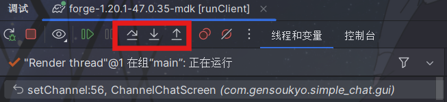

# 11.1 debug
IDEA为开发者准备了许许多多非常有用的debug功能

## 断点调试

使用调试模式启动游戏，即点击如下的按钮


左击行左侧的空白处即可打上断点，右击断点可以设置断点触发条件，或者在更多设置中进行更详细的配置，使用断点可以在程序运行到这一行时停止运行。

断点命中时，在`线程和变量`中可以查阅当前状态和方法调用链。同时，可以右击打开`对表达式求值`，对着你想要获取的对象直接求值。

也可以在`控制台`中返回查看游戏输出

断点命中后，也可以不用直接跳过恢复程序，使用这里的三个按键进行更详细的流程调试



他们分别可以帮助逐行调试，进入行内的方法调试和跳出该方法调试

熟练的进行断点调试可以快速帮忙找出可能的bug原因。

## jbr

JetBrain Runtime是idea自带的一套jdk，可以用来加速运行时热重载，使用时需要在`设置-构建、执行、部署-构建工具-gradle`中的`GradleJVM`设置为jbr

然后加入jvm参数`-XX:+AllowEnhancedClassRedefinition`

在gradle中可以在minecraft.run.client任务中添加这一行实现

``` gradle
        client {
            jvmArgs "-XX:+AllowEnhancedClassRedefinition"
        }
```

调试模式下，右键，找到`编译并重新加载文件`即可实现热重载

## Single Hotswap

相信大家都对`Minecraft Development`插件并不陌生，提供了`mixin补全`等功能，但是还是有很多其他有用的插件

快速热重载。开启这个插件后，会在主界面上方的启动，调试按钮后加一柄锤头。

IDEA自带的热重载会大规模重载很多类，这个插件实现只对现在修改的类进行重载，对于调试gui界面等场景下效果很好。