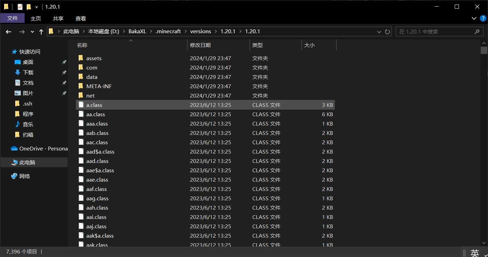

# 2.5.1.1 资源专题之原版参考

原版参考，很简单，就是一些原版的Blockstates，一些原版的模型，一些原版的材质，你要学会去借鉴和使用。

## 获得原版参考

首先你得学会怎么搞到原版的东西。

如果，你下载Minecraft时只下载了本体，没有下载Forge，你会发现你的游戏目录中有一个`1.20.1.jar`文件，解压它（没错，就是解压），我使用的是Bandzip。

解压出来大概长这样：

这里我不告诉各位原版的资源在哪，请读者们根据我们已学过的知识找到它。

## 怎么用

在做一些内容的时候，如果你需要添加一个方块或者物品，在做它的材质和模型的时候，想一想，在原版中有没有相似的内容。

比如你要做一个窗户，它是不是和玻璃板很像？那你就去找玻璃板，找到对应的Blockstates，再找到对应的model和texture，照着抄或者改写就完事了。

至于怎么找，请读者自行根据下一节的内容自行学习。

