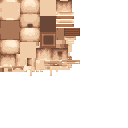
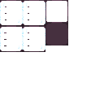

# 2.4稍微完善一下
## 目标

想想我们在[物品章节](item.md)和[方块章节](block.md)做的两项，一个只能通过`/give`命令获得，一个只能通过`/setblock`命令放置，这显然不是一个正常的物品或者方块该有的样子。

本章我们将会做两件事情：

- 让物品和方块都有正常的名字和材质
- 让物品可以在创造模式中直接拿到
- 让方块可以在创造模式中拿到对应的物品并且放置

注意，看起来描述都是“从创造模式拿到”，但是我的措辞不一样，待会儿要考）

## 资源包

在Forge中，名字和材质是在资源目录下定义的，也就是`src/main/resources`。

由于麻将的神必操作，现在Forge的资源文件只认这些目录下的内容：

- `assets/<modid>/lang`：本地化文件
- `assets/<modid>/textures/item`：物品材质文件
- `assets/<modid>/models/item`：物品模型文件
- `assets/<modid>/textures/block`：方块材质文件
- `assets/<modid>/models/block`：方块模型文件
- `assets/<modid>/blockstates`：方块状态文件

目前我们要用到的就是这些，其他的先不管。

## 物品
### 名字
给一个`名字`，其实就相当于在本地化文件中添加一个`键值对`，键是`物品id`，值是`名字`。可以简单理解为`id`和`名字`的对应关系

我们的`mod_id`是`thirst`，那么我们的本地文件应该创建在`assets/thirst/lang`目录下，虽然有两种形式，但是我们在MCG中提倡使用`json`格式的文件。

`zh_cn.json`文件对应了中文语言，`en_us.json`文件对应了英文语言。

如果我们想要给一个物品提供本地化，我们的格式应该是这样的：

```json
"item.<mod_id>.<item_id>": "<name>"
```

那么，我们的`zh_cn.json`文件应该是这样的：

```json
{
  "item.thirst.kettle": "水壶"
}
```

同样的，`en_us.json`文件应该是这样的：

```json
{
  "item.thirst.kettle": "Kettle"
}
```

此时我们再回到游戏，我们就会发现"item.thirst.kettle"这个物品的名字变成了"水壶"。


### 模型和材质
物品的模型应当放在`assets/<modid>/models/item/<item_id>.json`文件里，物品的材质应当放在`assets/<modid>/textures`目录下。

本节不讨论具体的模型和材质怎么制作，相关内容我希望读者可以自行探究，在[资源专题]()会有一些相关的指导。

经作者同意，在这里放出物品的模型和材质，会进行简单讲解，供读者参考。

#### 模型
```json
{
  "credit": "Made with Blockbench",
  "render_type": "cutout",
  "texture_size": [64, 64],
  "textures": {
    "0": "thirst:item/canteen",
    "particle": "thirst:item/canteen"
  },
  "elements": [
    {
      "from": [2, 1, 3],
      "to": [12, 8, 13],
      "rotation": {"angle": 0, "axis": "y", "origin": [8.38118, 4.5, 8]},
      "faces": {
        "north": {"uv": [2.5, 0, 5, 1.75], "texture": "#0"},
        "east": {"uv": [2.5, 1.75, 5, 3.5], "texture": "#0"},
        "south": {"uv": [2.5, 3.5, 5, 5.25], "texture": "#0"},
        "west": {"uv": [0, 5, 2.5, 6.75], "texture": "#0"},
        "up": {"uv": [2.5, 2.5, 0, 0], "texture": "#0"},
        "down": {"uv": [2.5, 2.5, 0, 5], "texture": "#0"}
      }
    },
    {
      "from": [15.19525, 5.88383, 7],
      "to": [16.19525, 10.88383, 9],
      "rotation": {"angle": 0, "axis": "y", "origin": [15.69525, 9.88383, 8]},
      "faces": {
        "north": {"uv": [3.75, 8.25, 4, 9.5], "texture": "#0"},
        "east": {"uv": [4.5, 7.5, 5, 8.75], "texture": "#0"},
        "south": {"uv": [6.25, 8.25, 6.5, 9.5], "texture": "#0"},
        "west": {"uv": [5, 7.5, 5.5, 8.75], "texture": "#0"},
        "up": {"uv": [8.75, 7, 8.5, 6.5], "texture": "#0"},
        "down": {"uv": [7.25, 8.5, 7, 9], "texture": "#0"}
      }
    },
    {
      "from": [10.21199, 12.31109, 7.025],
      "to": [12.21199, 13.31109, 8.975],
      "rotation": {"angle": 22.5, "axis": "z", "origin": [12.91199, 12.81109, 8]},
      "faces": {
        "north": {"uv": [8.5, 7, 9, 7.25], "texture": "#0"},
        "east": {"uv": [7.25, 8.5, 7.75, 8.75], "texture": "#0"},
        "south": {"uv": [8.5, 7.25, 9, 7.5], "texture": "#0"},
        "west": {"uv": [7.75, 8.5, 8.25, 8.75], "texture": "#0"},
        "up": {"uv": [5, 5.75, 4.5, 5.25], "texture": "#0"},
        "down": {"uv": [0.5, 8.5, 0, 9], "texture": "#0"}
      }
    },
    {
      "from": [16.27255, 10.76308, 7.025],
      "to": [19.27255, 11.76308, 8.975],
      "rotation": {"angle": -45, "axis": "z", "origin": [16.67255, 15.03808, 8]},
      "faces": {
        "north": {"uv": [8.5, 5, 9.25, 5.25], "texture": "#0"},
        "east": {"uv": [2, 8.75, 2.5, 9], "texture": "#0"},
        "south": {"uv": [8.5, 5.25, 9.25, 5.5], "texture": "#0"},
        "west": {"uv": [2.5, 8.75, 3, 9], "texture": "#0"},
        "up": {"uv": [3.75, 8.75, 3, 8.25], "texture": "#0"},
        "down": {"uv": [6.25, 8.25, 5.5, 8.75], "texture": "#0"}
      }
    },
    {
      "from": [12.07393, 12.00515, 7],
      "to": [14.07393, 13.00515, 9],
      "rotation": {"angle": 0, "axis": "y", "origin": [13.07393, 12.50515, 8]},
      "faces": {
        "north": {"uv": [8.5, 8, 9, 8.25], "texture": "#0"},
        "east": {"uv": [8.25, 8.5, 8.75, 8.75], "texture": "#0"},
        "south": {"uv": [8.5, 8.25, 9, 8.5], "texture": "#0"},
        "west": {"uv": [1.5, 8.75, 2, 9], "texture": "#0"},
        "up": {"uv": [1, 9, 0.5, 8.5], "texture": "#0"},
        "down": {"uv": [1.5, 8.5, 1, 9], "texture": "#0"}
      }
    },
    {
      "from": [3, 8, 4],
      "to": [11, 14, 12],
      "rotation": {"angle": 0, "axis": "y", "origin": [8.38118, 4.5, 8]},
      "faces": {
        "north": {"uv": [4.5, 6, 6.5, 7.5], "texture": "#0"},
        "east": {"uv": [6.5, 6, 8.5, 7.5], "texture": "#0"},
        "south": {"uv": [0, 6.75, 2, 8.25], "texture": "#0"},
        "west": {"uv": [7, 0, 9, 1.5], "texture": "#0"},
        "up": {"uv": [7, 6, 5, 4], "texture": "#0"},
        "down": {"uv": [4.5, 5.25, 2.5, 7.25], "texture": "#0"}
      }
    },
    {
      "from": [10.50248, 4.2921, 7.025],
      "to": [16.50248, 5.2921, 8.975],
      "rotation": {"angle": 45, "axis": "z", "origin": [14.42748, 4.7171, 8]},
      "faces": {
        "north": {"uv": [5.5, 8, 7, 8.25], "texture": "#0"},
        "east": {"uv": [8.5, 5.75, 9, 6], "texture": "#0"},
        "south": {"uv": [7, 8, 8.5, 8.25], "texture": "#0"},
        "west": {"uv": [8.5, 6, 9, 6.25], "texture": "#0"},
        "up": {"uv": [8.5, 5.5, 7, 5], "texture": "#0"},
        "down": {"uv": [8.5, 5.5, 7, 6], "texture": "#0"}
      }
    },
    {
      "from": [1.5, 14, 5],
      "to": [3.5, 15, 11],
      "rotation": {"angle": 0, "axis": "y", "origin": [8.38118, 4.5, 8]},
      "faces": {
        "north": {"uv": [4.5, 5.75, 5, 6], "texture": "#0"},
        "east": {"uv": [8, 4.5, 9.5, 4.75], "texture": "#0"},
        "south": {"uv": [8.5, 5.5, 9, 5.75], "texture": "#0"},
        "west": {"uv": [8, 4.75, 9.5, 5], "texture": "#0"},
        "up": {"uv": [2.5, 8.25, 2, 6.75], "texture": "#0"},
        "down": {"uv": [7.5, 3.5, 7, 5], "texture": "#0"}
      }
    },
    {
      "from": [10, 14, 5],
      "to": [12, 15, 11],
      "rotation": {"angle": 0, "axis": "y", "origin": [10.75, 14.5, 8]},
      "faces": {
        "north": {"uv": [8.5, 6.25, 9, 6.5], "texture": "#0"},
        "east": {"uv": [0, 8.25, 1.5, 8.5], "texture": "#0"},
        "south": {"uv": [6.5, 8.5, 7, 8.75], "texture": "#0"},
        "west": {"uv": [1.5, 8.25, 3, 8.5], "texture": "#0"},
        "up": {"uv": [4.5, 8.75, 4, 7.25], "texture": "#0"},
        "down": {"uv": [8, 3.5, 7.5, 5], "texture": "#0"}
      }
    },
    {
      "from": [2.5, 14, 3.5],
      "to": [11.5, 15, 5],
      "rotation": {"angle": 0, "axis": "y", "origin": [7, 14.5, 4.5]},
      "faces": {
        "north": {"uv": [5.5, 7.5, 7.75, 7.75], "texture": "#0"},
        "east": {"uv": [3, 8.75, 3.375, 9], "texture": "#0"},
        "south": {"uv": [5.5, 7.75, 7.75, 8], "texture": "#0"},
        "west": {"uv": [4, 8.75, 4.375, 9], "texture": "#0"},
        "up": {"uv": [9.25, 1.875, 7, 1.5], "texture": "#0"},
        "down": {"uv": [9.25, 2, 7, 2.375], "texture": "#0"}
      }
    },
    {
      "from": [2.5, 14, 11],
      "to": [11.5, 15, 12.5],
      "rotation": {"angle": 0, "axis": "y", "origin": [7, 14.5, 11.5]},
      "faces": {
        "north": {"uv": [7.75, 7.5, 10, 7.75], "texture": "#0"},
        "east": {"uv": [4.5, 8.75, 4.875, 9], "texture": "#0"},
        "south": {"uv": [7.75, 7.75, 10, 8], "texture": "#0"},
        "west": {"uv": [5, 8.75, 5.375, 9], "texture": "#0"},
        "up": {"uv": [9.25, 2.875, 7, 2.5], "texture": "#0"},
        "down": {"uv": [9.25, 3, 7, 3.375], "texture": "#0"}
      }
    },
    {
      "from": [1.12409, 13.41836, 6],
      "to": [4.12409, 14.41836, 10],
      "rotation": {"angle": -22.5, "axis": "z", "origin": [2.32409, 14.11836, 8]},
      "faces": {
        "north": {"uv": [1.5, 8.5, 2.25, 8.75], "texture": "#0"},
        "east": {"uv": [6.5, 8.25, 7.5, 8.5], "texture": "#0"},
        "south": {"uv": [2.25, 8.5, 3, 8.75], "texture": "#0"},
        "west": {"uv": [7.5, 8.25, 8.5, 8.5], "texture": "#0"},
        "up": {"uv": [3.25, 8.25, 2.5, 7.25], "texture": "#0"},
        "down": {"uv": [4, 7.25, 3.25, 8.25], "texture": "#0"}
      }
    },
    {
      "from": [3, 0, 4],
      "to": [11, 1, 12],
      "rotation": {"angle": 0, "axis": "y", "origin": [8.38118, 4.5, 8]},
      "faces": {
        "north": {"uv": [8, 3.5, 10, 3.75], "texture": "#0"},
        "east": {"uv": [8, 3.75, 10, 4], "texture": "#0"},
        "south": {"uv": [8, 4, 10, 4.25], "texture": "#0"},
        "west": {"uv": [8, 4.25, 10, 4.5], "texture": "#0"},
        "up": {"uv": [7, 2, 5, 0], "texture": "#0"},
        "down": {"uv": [7, 2, 5, 4], "texture": "#0"}
      }
    }
  ],
  "display": {
    "thirdperson_righthand": {
      "rotation": [45, -90, 0],
      "translation": [0, 1, -1.75],
      "scale": [0.5, 0.5, 0.5]
    }
  }
}
```
#### 材质


#### 完成效果
完成后的效果如下：


## 方块
### 名字
方块的名字和物品的名字一样，也是在本地化文件中添加一个`键值对`，键是`方块id`，值是`名字`。可以简单理解为`id`和`名字`的对应关系

格式如下：
```json
"block.<mod_id>.<block_id>": "<name>"
```

那么，我们的`zh_cn.json`文件应该是这样的：

```json
{
  "block.thirst.cistern": "水箱"
}
```

同样的，`en_us.json`文件应该是这样的：

```json
{
  "block.thirst.cistern": "Cistern"
}
```

### 模型和材质
方块应当使用什么模型会在`assets/<modid>/blockstates/<block_id>.json`文件中定义。

而模型（注意，物品的模型文件名必须是物品ID，但是方块不作此限制）和材质的位置类似物品，在`assets/<modid>/models/block`和`assets/<modid>/textures/block`目录下。

同样的，本节不讨论具体的模型和材质怎么制作，相关内容我希望读者可以自行探究，在[资源专题]()会有一些相关的指导。

由于我们的方块的特殊性质（这会在以后详细说明），我将注册时的代码进行修改：

```java
public static final RegistryObject<Block> CISTERN = BLOCKS.register("cistern", () -> new Block(BlockBehaviour.Properties.of().noOcclusion()));
```

虽然我后续会讲解这个更改的理由是什么，但是感兴趣的话也可以自己进行探究（比如如果不进行这个修改会发生什么）

与物品不同的是，这里会简单讲解blockstates文件的内容。不过，先把几个文件的具体内容放在下面：

#### blockstates文件
```json
{
  "variants": {
    "": [{
      "model": "thirst:block/sink_septex0"
    }]
  }
}
```

#### 模型
```json
{
	"credit": "Made with Blockbench",
	"render_type": "translucent",
	"texture_size": [64, 64],
	"textures": {
		"0": "thirst:block/sink",
		"particle": "thirst:block/sink"
	},
	"elements": [
		{
			"name": "sink",
			"from": [1, 0, 1],
			"to": [15, 16, 15],
			"faces": {
				"north": {"uv": [0, 0, 3.5, 4], "texture": "#0"},
				"east": {"uv": [3.5, 0, 7, 4], "texture": "#0"},
				"south": {"uv": [0, 4, 3.5, 8], "texture": "#0"},
				"west": {"uv": [3.5, 4, 7, 8], "texture": "#0"},
				"up": {"uv": [10.5, 3.5, 7, 0], "texture": "#0"},
				"down": {"uv": [10.5, 3.5, 7, 7], "texture": "#0"}
			}
		}
	]
}
```
#### 材质


在完成后，方块将会变成这样：


### 讲解blockstates文件
和语言文件一样，只要是json格式的文件，那都是键值对的形式，只是这里出现了几层嵌套。

首先，我们要知道，这个文件的作用是什么。

在Forge中，一个方块可能会有多种模型，例如说半砖，在不同组合、不同放置方向下会表现出不同的模型，这时候就需要用到blockstates文件。

blockstates文件的作用就是指定在什么状态下使用什么模型。

`variants`翻译过来就是变种，以它作为键，它的内容就是在不同情况下的模型文件的位置。

而接下来的`""`，是一个空字符串，这个空字符串表示默认情况下的模型文件的位置，在这里，`thirst:block/sink_septex0`就表示我们此时应当使用的模型文件应该是`assets/thirst/models/block/sink_septex0.json`。

至于这里的的`""`，里面的内容是什么，这就和Properties有关了。虽然这不应该是这个章节的内容，但是出于某些原因（再多看几章你就知道为什么了），我在这里简单讲述下。

在Minecraft中，方块的状态是由Properties来决定的，例如半砖，它的Properties有`type`一种，表示半砖是放在上半部分、下半部分还是全方块。

那么一个简单的半砖的blockstates文件应该是这样的：

```json
{
  "variants": {
    "type=bottom": [{
      "model": "<mod_id>:block/<model_file_name1>"
    }],
    "type=top": [{
      "model": "<mod_id>:block/<model_file_name2>"
    }],
    "type=double": [{
      "model": "<mod_id>:block/<model_file_name3>"
    }]
  }
}
```
这时候就表示了在不同的Properties下使用不同的模型文件，当然，如果你其中两条指向了相同的模型文件，那么这两个Properties就会有相同的模型。

### 数组？
你可能注意到了，在Properties的键值对中，值是用`[]`包裹的，这表示它的值是一个数组。

这个数组的含义其实很简单，如果你在一个Properties下使用了多个模型文件，那么在这个状态下，方块会随机挑选一个模型文件来使用。

## 创造模式物品栏
### 引入现有创造模式物品栏

引入现有创造模式物品栏也要求我们订阅一个事件，这个事件是`BuildCreativeModeTabContentsEvent`。

在这里，我们需要使用另一形式来订阅时间，具体原因见[概念解析](conceptions.md)。

我们先新建一个软件包`moe.gensoukyo.thirst.event`，然后建立一个类`ModEventSubscriber`，然后在这个类中添加如下代码：

```java
import net.minecraft.world.item.CreativeModeTabs;
import net.minecraftforge.event.BuildCreativeModeTabContentsEvent;
import net.minecraftforge.eventbus.api.SubscribeEvent;
import net.minecraftforge.fml.common.Mod;

import static moe.gensoukyo.thirst.Thirst.MODID;
import static moe.gensoukyo.thirst.register.ItemRegister.KETTLE;

@Mod.EventBusSubscriber(bus = Mod.EventBusSubscriber.Bus.MOD, modid = MODID)
public class ModEventSubscriber {
    @SubscribeEvent
    public static void addCreativeTab(BuildCreativeModeTabContentsEvent event) {
        if (event.getTabKey() == CreativeModeTabs.FOOD_AND_DRINKS) {
            event.accept(KETTLE.get());
        }
    }
}
```

首先要说明的是，和脚本不一样，在Modding中，不同文件之间可以是有关联的，所以我们需要通过`import`关键字来引入其他文件中的内容。

像我们之前的`MODID`和`KETTLE`，都是在其他文件中定义的，我们通过`import`关键字来引入这些内容。

然后，我们在这个类中添加了一个静态方法`addCreativeTab`，这个方法的参数是`BuildCreativeModeTabContentsEvent`，这个参数就是我们要订阅的事件的类。

顾名思义，这个类所指向的事件就是构建创造模式物品栏的事件。

在这个方法中，我们首先判断了正在构建的创造模式物品栏是否是`食物与饮品`，如果是，那么我们就把`KETTLE`，也就是我们的水壶这个物品放进去。

这样我们就可以在创造模式中拿到我们的水壶了。

### 那方块呢？

现在你可以尝试一下，如果用中键来尝试复制水箱方块，你会发现你根本获取不到这个方块。

那是因为这个方块它只是一个方块，它没有对应的物品。

所以我们需要单独为它注册一个物品，同时我们需要让他是一个`ItemBlock`类的`Item`，这样我们才能将它与我们的方块对应起来。

此时我们不需要再为它起一个名字了，因为它的名字就是方块的名字。

而如果我们不为它特别做一个模型，我们也可以通过一种形式让它和方块共用一个模型（我们会在[资源专题]()中讲解）。

此处为具体的代码：

#### ItemRegister.java
```java
// imports

public class ItemRegister {
    public static final DeferredRegister<Item> ITEMS = DeferredRegister.create(ForgeRegistries.ITEMS, MODID);

    public static final RegistryObject<Item> KETTLE = ITEMS.register("kettle", () -> new Item(new Item.Properties()));

    public static final RegistryObject<Item> CISTERN = ITEMS.register("cistern", () -> new BlockItem(BlockRegister.CISTERN.get(), new Item.Properties()));
}
```

#### models/item/cistern.json

```json
{
  "parent": "thirst:block/sink_septex0"
}
```

### 自定义创造模式物品栏

当然，我们总不能一直用原生的创造模式物品栏，我们也可以自己定义一个。

和注册物品一样，我们需要将创造模式物品栏进行注册，注册方式和注册物品大差不差。

在`moe.gensoukyo.thirst.register`包中新建一个类`CreativeTabsRegister`，然后在这个类中添加如下代码：

```java
// imports 

public class CreativeTabRegister {
    public static final DeferredRegister<CreativeModeTab> CREATIVE_TABS = DeferredRegister.create(Registries.CREATIVE_MODE_TAB, MODID);

    public static final RegistryObject<CreativeModeTab> THIRST = CREATIVE_TABS.register("thirst_tab", () -> CreativeModeTab.builder()
            .title(Component.translatable("item_group." + MODID + ".thirst_tab"))
            .icon(() -> new ItemStack(ItemRegister.CISTERN.get()))
            .displayItems((params, output) -> {
                output.accept(ItemRegister.CISTERN.get());
            })
            .build());
}

```
有没有感觉比注册物品的长多了？

其实很简单，注册物品的时候我们注册的还是个啥用没有的物品，我们不需要给它添加任何的属性，所以它看起来很短。

但是创造模式物品栏不一样，它需要我们定义它的名字、图标、里面的物品等等，所以看起来就很长，但实际上两者是差不多的。

以下是几个要注意的点：

- 在使用DeferredRegister时，我们需要使用`Registries`类中的`CREATIVE_MODE_TAB`变量，而不是`ForgeRegistries.CREATIVE_MODE_TAB`，我们要存储的类型的来源和物品不一样
- 在`title`中，我们使用了`Component.translatable`方法，这个方法的参数是一个字符串，这个字符串就是我们在本地化文件中定义的`键`，这样我们就可以在不同的语言环境下显示不同的名字了，此处我们相当于将键定义为了`item_group.thirst.thirst_tab`。
- 在`icon`中，我们使用了`ItemStack`，并使用了`ItemRegister.CISTERN.get()`，这个方法的作用是获取`CISTERN`这个物品的`ItemStack`，这样就让我们的水壶的样子变成该创造模式物品栏的图标。
- 在`displayItems`中，我们使用了这一形式的匿名函数（可以理解为临时的函数），在里面定义了这个物品栏里面有哪些物品。
- 最后的`build`则是将这个物品栏构建成一个`CreativeModeTab`类的实例。

然后我们在Mod的构造函数中添加这一行将该物品栏注册到Mod事件总线中：

```java
CREATIVE_TABS.register(bus);
```

最后在本地化文件中添加如下内容：

```json
{
  "item_group.thirst.thirst_tab": "Thirst"
}
```

```json
{
  "item_group.thirst.thirst_tab": "口干舌燥"
}
```

这样我们就可以在创造模式中看到我们自定义的创造模式物品栏和里面的物品了。


## 本节所有内容后的文件结构


## 特别说明
本教程中，模型文件和材质文件的制作均由Minecraft幻想乡美工组成员KotiyaSanae完成。

本教程中，所有模型文件和材质文件的使用均由KotiyaSanae授权，未经许可，不得擅自转载或用于商业用途。

## Forge相关概念
- Item与ItemStack
- Block与BlockState