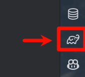
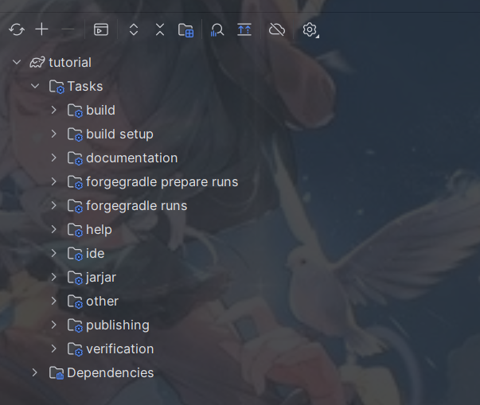
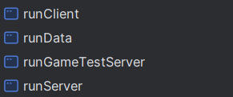

# 1.1 配置开发环境
## IDE的选择
在这本书中，所有的情况全部基于使用IntelliJ IDEA。如果你用的是Eclipse或者别的什么，很抱歉的是我没法为你提供什么合适的帮助。

## 配置开发环境
### 安装JDK
- 下载[Oracle Java](https://download.oracle.com/java/17/latest/jdk-17_windows-x64_bin.exe)安装包
- 无脑下一步
## 下载IDEA
- 打开[IDEA官网](https://www.jetbrains.com/idea/download/?section=windows)
- 点击Download
- 双击安装包
- 无脑下一步
- 恭喜你完成了

## 下载开发环境
上面两步和[脚本开发](https://minecraftgensoukyo.github.io/Tutorial/build-enviroment/edit-enviroment/)环境配置是一样的，从这步开始出现差异。
所谓开发环境就是MDK，下载方式有三种
### 官网下载（需要魔法）
- 打开[Forge官网](https://files.minecraftforge.net/net/minecraftforge/forge/index_1.20.1.html)页面
- 点击`Download Recommended`的`Mdk`按钮下载最新稳定版MDK的压缩包
- 如果你想要用和本教程相同的MDK版本（虽然没有必要），点击`Show all Versions`，点击展开页面中的`47.1.0`版本的`Mdk`按钮
- 点击按钮后，等待五秒钟，点击右上方的Skip按钮即可开始下载
### 官网下载（无需魔法）
- 打开[Forge官网](https://files.minecraftforge.net/net/minecraftforge/forge/index_1.20.1.html)页面
- 点击`Show all Versions`按钮，找到你想要下载的版本
- 找到那行的`Mdk`按钮，在它的右方有一个表示信息的按钮，将鼠标停留在那个按钮上，它会展现一个悬浮窗
- 点击悬浮窗中的`Direct Download`按钮
### 群文件下载（不推荐）
- 在技术组考核群的群文件中找文件`forge-1.20.1-47.1.0-mdk.zip`，下载即可

## 构建环境
- 解压zip文件，这里我以解压到`E:\mods\tutorial`目录下为例。
- 打开IDEA（在这里我用的是职业版，页面会少许不一样，但是基本操作是一样的），点击`Open`

- 在IDEA内打开`E:\mods\tutorial\build.gradle`文件（如果你用的是专业版可以直接打开`E:\mods\tutorial\`目录）
- 选择`作为项目打开`
- 打开后看向窗口右边，你应该会看到一个大象一样的图标，就像这样

- 打开这个侧边栏，并点击这个刷新一样的按钮（重新加载所有Gradle项目），如果刷新按钮是灰的那就说明它已经在执行这个工作了
- 你的可能不是中文，没关系，看图标点就行了

- 在加载成功（下方终端出现`BUILD SUCCESSFUL`字样）后，点开tutorial目录，你应该会看到这些内容：

- 打开`forgegradle runs`目录，双击运行`genIntelliJRuns`
- 看向顶部运行图标的左侧，点开下拉菜单，看到这些内容就说明运行成功了（可能会延迟一段时间）

到此为止，你的环境构建就全部完成了