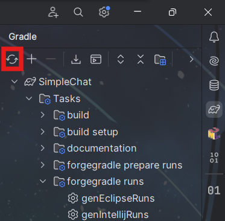

# AccessTransformer
访问转换器（简称AT）允许扩大可见性并修改类、方法和字段的final标志。它们允许模组开发者访问和修改其控制之外的类中不可访问的成员。

这方面的教程可以直接阅读中文forge文档[ACcessTransform](https://forge-doc-120x-zh-cn.readthedocs.io/zh-cn/latest/advanced/accesstransformers/)

关于srg名，可以使用Minecraft插件查询，对着需要查询的字段或方法右键查询srg名。

也可以在这里直接查询[Linkie](https://linkie.shedaniel.dev/mappings?namespace=mojang_srg&version=1.20.1&search=&translateMode=none)

在使用AT之前，首先需要在gradle中添加如下部分
``` java
// 此代码块也是指定映射版本的位置
minecraft {
  accessTransformer = file('src/main/resources/META-INF/accesstransformer.cfg')
}
```

当然，如果你使用的是Forge分发的mdk，也可以在minecraft{}中找到被注释掉的这行，只需要直接恢复就好了

这里给出部分案例

比如AbstractContainerScreen的tick方法是final，不能被子类覆写。那这里就可以使用AT将final标志移除

在Linkie中查到AT：`public-f net.minecraft.client.gui.screens.inventory.AbstractContainerScreen m_86600_()V # tick`

直接在`accesstransformer.cfg`加入上面这行字，然后在IDEA-文件中使缓存失效，重载gradle项目，构建完成后，就能看到该方法不再是final方法了


``` java
   public void tick() {
      super.tick();
      if (this.minecraft.player.isAlive() && !this.minecraft.player.isRemoved()) {
         this.containerTick();
      } else {
         this.minecraft.player.closeContainer();
      }

   }
```

关于方法签名，可以在neoforge文档中查阅[Specifying Types](https://docs.neoforged.net/docs/advanced/accesstransformers/#specifying-types)