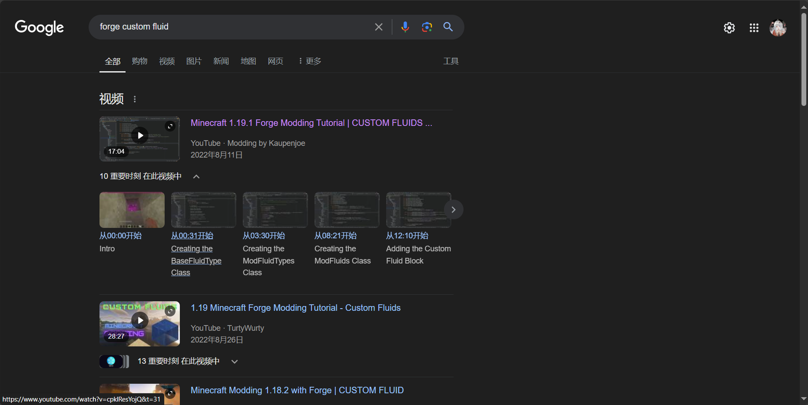

# 6.1.1 搜索

我们的目标是获取流体的制作方法，那么这里我采用"forge", "custom fluid"两个关键词在谷歌搜索引擎上搜索（建议使用国际的搜索引擎），搜索结果如图所示。

正如我之前所说，你很难找到最新的有效内容，不过既然都这样了，不妨试试这个视频介绍的内容吧？

（事实上，forge开发的相关教程你想找总是能找到的，但是从时间成本上来讲，不值得）

在进入这个视频之后，事实上这个视频的内容都是实际有效的内容，于是，这个问题就很简单地被解决了。

本节的内容由于要从头开始做会破坏本身我自己的项目规划，加之搜索引擎不是一个很难使用的方式，所以在此不作复刻，请各位读者自行完成相关内容的学习制作。